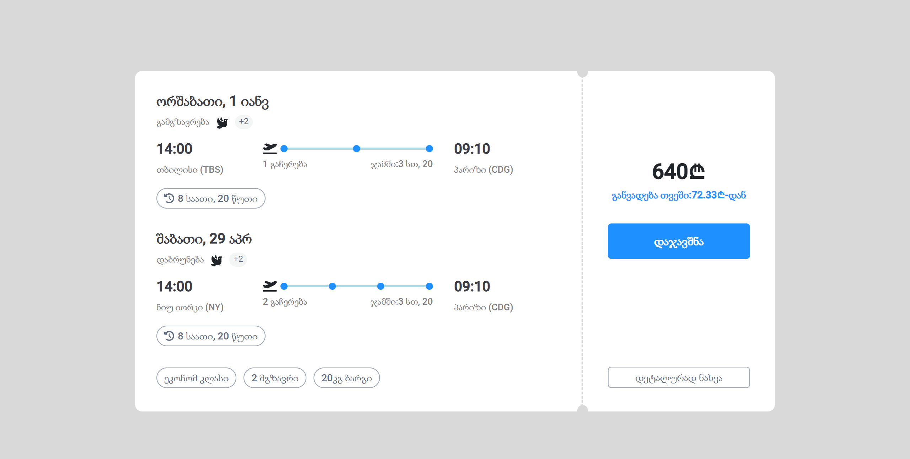
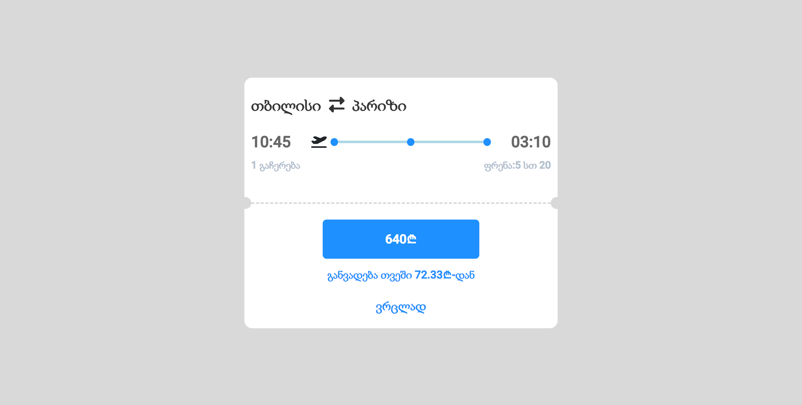

## Table of contents

- [General info](#general-info)
- [Technologies](#technologies)
- [Setup](#setup)
- [Website functionalities](#Website-functionalities)

## General info

responsive markup for ticket using angular, components are loaded using \*ngIf and listening to window:resize event. when window width goes below 1200px mobile component gets loaded instead of desktop.

## Technologies

The project is created with:

- Angular 15
- typescript
- Angular material
- bootstrap
- font-awasome

## Setup

To run this project, run following commands.

```
$ npm install
$ ng serve

```

## Components

- desktop ticket
  

- mobile ticket

  
